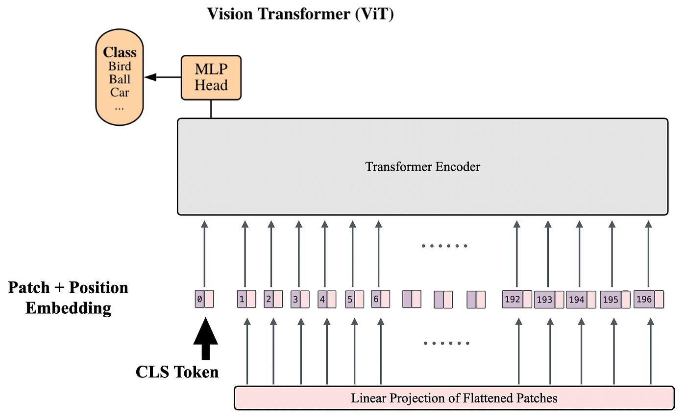
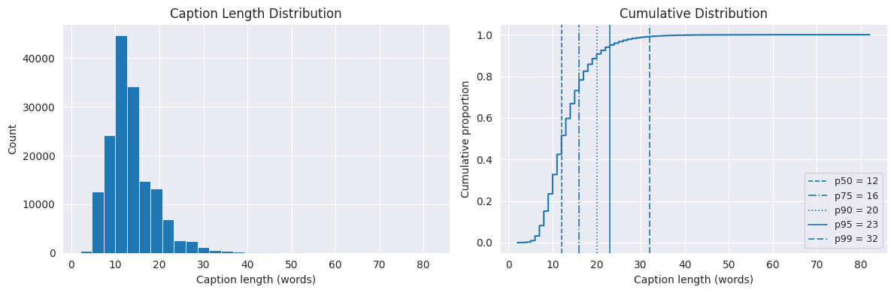
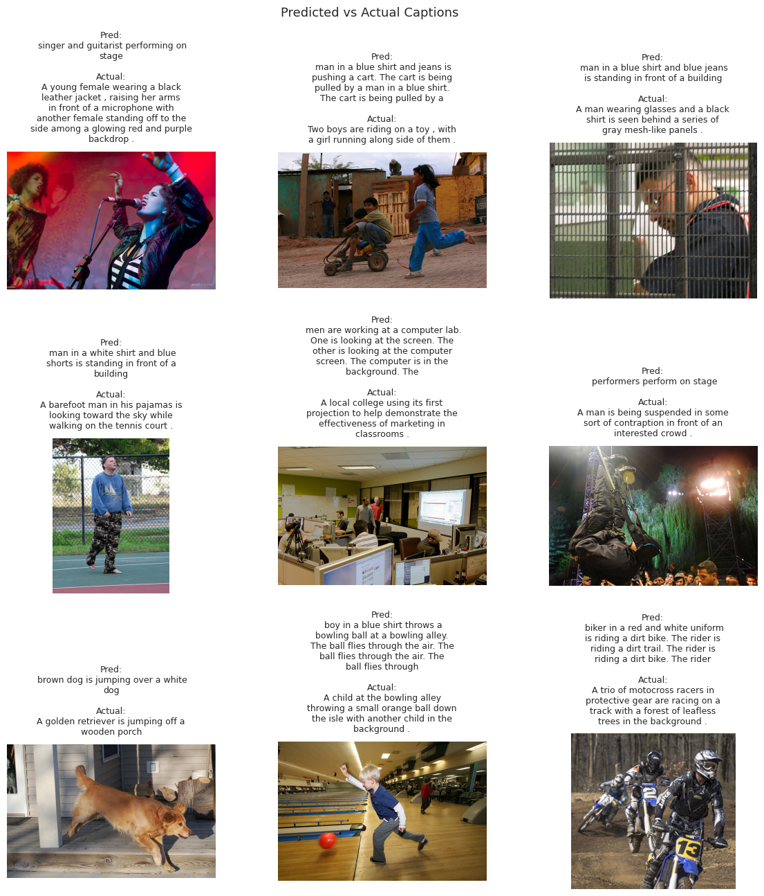
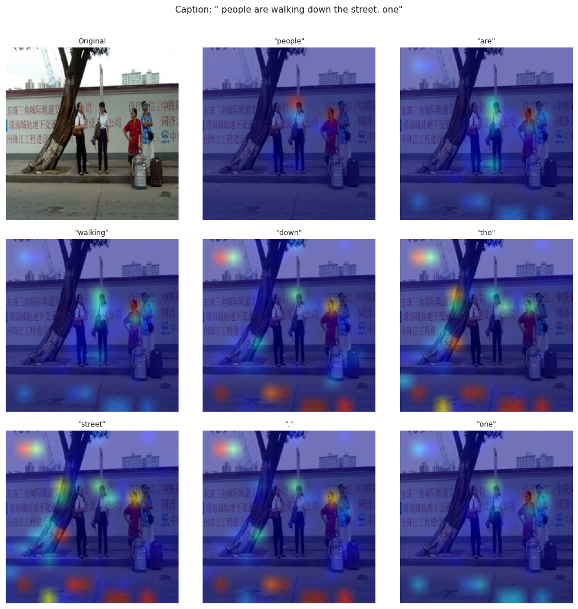
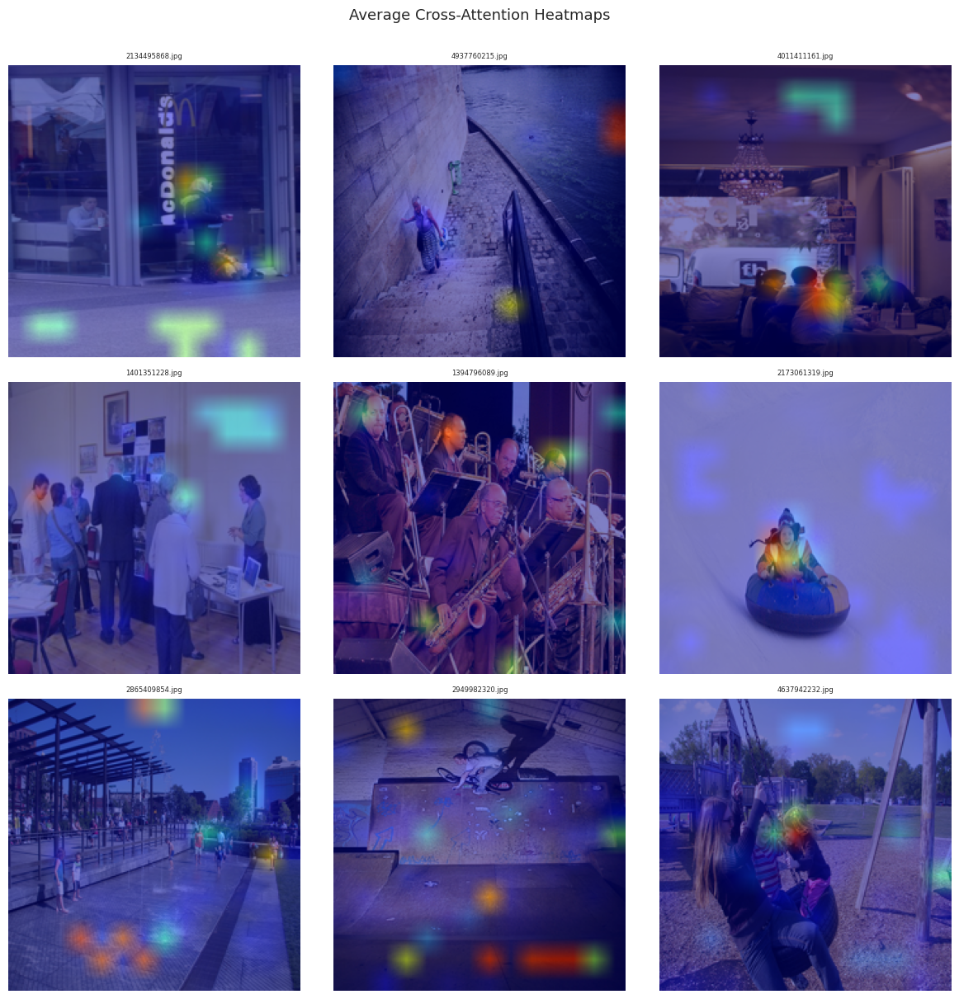

<h1 align="center">Image Captioning with Vision Transformers and Attention Mechanisms</h1>

<div align="center">

[](https://www.python.org)

[]()
[](https://www.tensorflow.org/)

</div>

<p align="center">Implementing an image captioning model with attention insight using the Flickr30k dataset, with ViT-Base/16 as the encoder and GPT-2 as the decoder</p>


<p>Image Credit: Mao Jia</p>

## Objective

Image captioning sits at an interesting intersection of computer vision and natural language generation. The goal is to teach a model to look at a photo and produce a meaningful, human-readable sentence describing what it sees. This is harder than it sounds. The model needs to identify objects, understand spatial relationships, and express all of that in fluent language.

In this project, I built an image captioning model from scratch using two powerful pretrained architectures: **ViT-Base/16** as the visual encoder and **GPT-2** as the language decoder. The ViT model processes an image by dividing it into 16×16 pixel patches and encoding them as a sequence of tokens, much like how a transformer processes words. Those patch embeddings are then passed to GPT-2 as cross-attention context, guiding the text generation word by word.

Beyond just getting the model to produce captions, I was also interested in understanding *what the model looks at* when it generates each word. The attention visualisation section explores this by overlaying cross-attention heatmaps on the original images, revealing which patches the decoder focuses on at each step.


## Dataset

The project uses the **[Flickr30k dataset](https://www.kaggle.com/datasets/adityajn105/flickr30k)**, which contains 31,783 images, each paired with five human-written captions. That gives a total of roughly 158,000 caption-image pairs, covering a diverse range of everyday scenes and activities.


For training purposes, I worked with a subset of 10,000 unique images (50,000 captions in total) to keep compute manageable on a Kaggle T4 GPU. The data was split 70/15/15 into training, validation, and test sets respectively, partitioned at the image level to prevent any leakage.


## Exploratory Data Analysis

Before jumping into modelling, I spent some time understanding the caption length distribution across the dataset. Most captions fall between 10 and 16 words, with a median of 12 words and a 99th percentile at 32 words. This informed the `max_len = 32` truncation setting used during tokenisation.




## Approach

### Architecture

The model pairs two pretrained transformers in an encoder-decoder setup:

**Encoder (ViT-Base/16):** I partitioned the image into 196 non-overlapping 16×16 patches plus one CLS token which gives 197 tokens in total. These are processed by the Vision Transformer and the resulting patch embeddings are projected into GPT-2's hidden dimension space.

**Decoder (GPT-2 with cross-attention):** I loaded GPT-2 with `add_cross_attention=True`, which adds a cross-attention layer to each of its 12 transformer blocks. The projected ViT embeddings serve as the key and value inputs for this cross-attention, so at every decoding step, GPT-2 can directly attend to different regions of the image.

A single linear projection layer bridges the ViT hidden dimension (768) to GPT-2's embedding dimension (768). In this case the dimensions happen to match, but the projection layer is included as good practice for cases where they do not.

The ViT encoder is frozen during training to stabilise early optimisation. Only GPT-2 and the projection layer are updated, giving 153.4M trainable parameters out of 239.8M total.

### Training

I trained for a single epoch on 7,000 images (35,000 caption-image pairs), using AdamW with a learning rate of 3e-4, gradient clipping at 1.0, a linear warmup schedule over 500 steps, and mixed-precision (fp16) via PyTorch's `GradScaler`. This was done on a Kaggle T4 GPU.

| Split | Images | Captions |
|-------|--------|----------|
| Train | 7,000  | 35,000   |
| Val   | 1,500  | 7,500    |
| Test  | 1,500  | 7,500    |

Training loss: **3.0919** | Validation loss: **2.8038**


## Results

Captions were generated for all 1,500 test images using greedy decoding, and evaluated against all five reference captions per image using standard metrics.

| Metric   | Score  |
|----------|--------|
| BLEU-1   | 0.3405 |
| BLEU-4   | 0.0640 |
| METEOR   | 0.2654 |
| ROUGE-L  | 0.3132 |
| CIDEr    | 0.1035 |

These scores reflect a model trained for only one epoch on a subset of the data, so there is considerable room to improve with longer training, unfreezing the ViT, and beam search decoding. Even so, the model produces recognisable and often semantically reasonable captions for a wide variety of images.

The grid below shows predicted captions alongside ground-truth captions on a random sample from the test set.




## Attention Visualisation

One of the more interesting parts of this project is the attention analysis. Because GPT-2 attends to the ViT patch embeddings via cross-attention at every decoding step, we can extract those attention weights and visualise which regions of the image were most relevant when each word was generated.

The visualisation below shows per-token cross-attention maps for a single image. Warmer colours (red, orange) indicate higher attention. Notice how the model shifts focus across different parts of the image as it generates each successive word.



In addition to per-token maps, I computed the average cross-attention across all generated tokens to get a single summarised heatmap per image. This gives a sense of which image regions the model found most informative overall during caption generation.




## Reproducing the Results

**Dependencies**

```bash
pip install evaluate rouge_score nltk pycocoevalcap timm
pip install transformers==4.40.0
```

**Key configuration**

```python
CFG = dict(
    subset_size = 10_000,
    max_len = 32,
    batch_size = 32,
    num_epochs = 1,
    lr = 3e-4,
    warmup_steps = 500,
    img_size = 224,
    vit_model = "google/vit-base-patch16-224",
    gpt_model = "gpt2",
    freeze_vit = True,
    seed = 42,
)
```

The notebook is structured as follows:

1. Install and import libraries
2. Load captions
3. Exploratory data analysis
4. Data preparation (tokenisation, dataset class, dataloaders)
5. Model definition (ViTGPT2Captioner)
6. Training
7. Evaluation (BLEU, METEOR, ROUGE-L, CIDEr)
8. Attention visualisation


## Limitations

This project is a focused exploration rather than a production system, and a few honest limitations are worth noting. Training for a single epoch on 10,000 images is a starting point, not a ceiling. Longer training, unfreezing the ViT after a few warm-up epochs, and using beam search instead of greedy decoding would all meaningfully improve caption quality.

The relatively low CIDEr score (0.10) reflects the fact that the model sometimes generates repetitive or generic phrases, a known failure mode of greedy decoding with GPT-2. Nucleus sampling or beam search would likely address this.

On the positive side, the attention maps are genuinely interpretable. Even with limited training, the model learns to focus on semantically meaningful image regions while generating related words, which suggests the cross-attention mechanism is functioning as intended.


## Disclaimer
Do I understand anything in this repository? Capital NO 😭😭😭

Will I do another project like this? Probably YES 🤧
